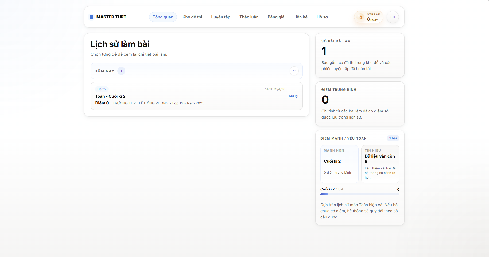
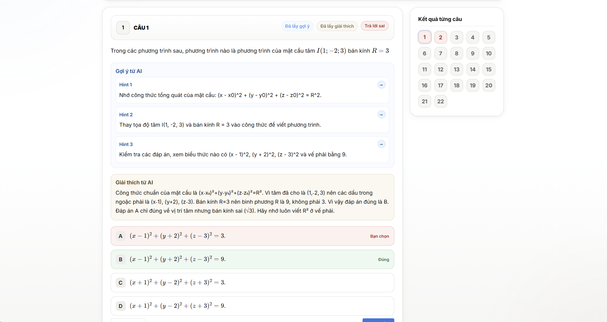
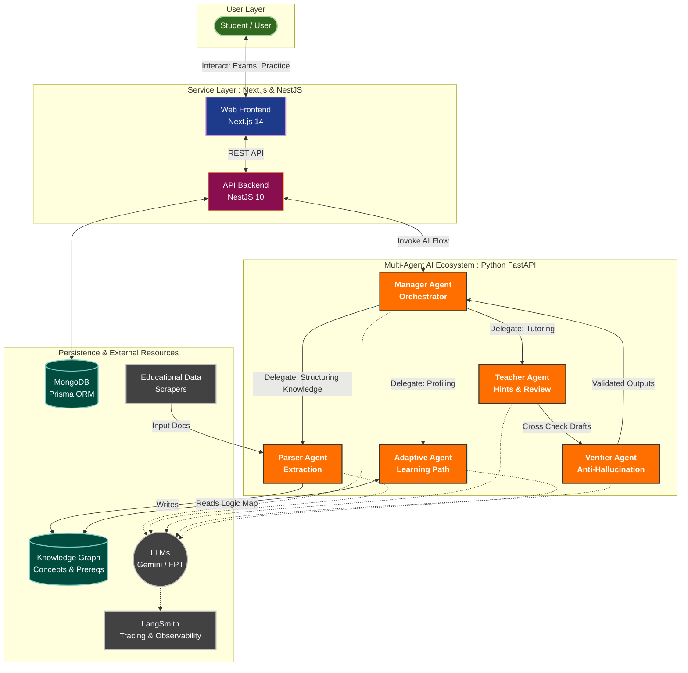
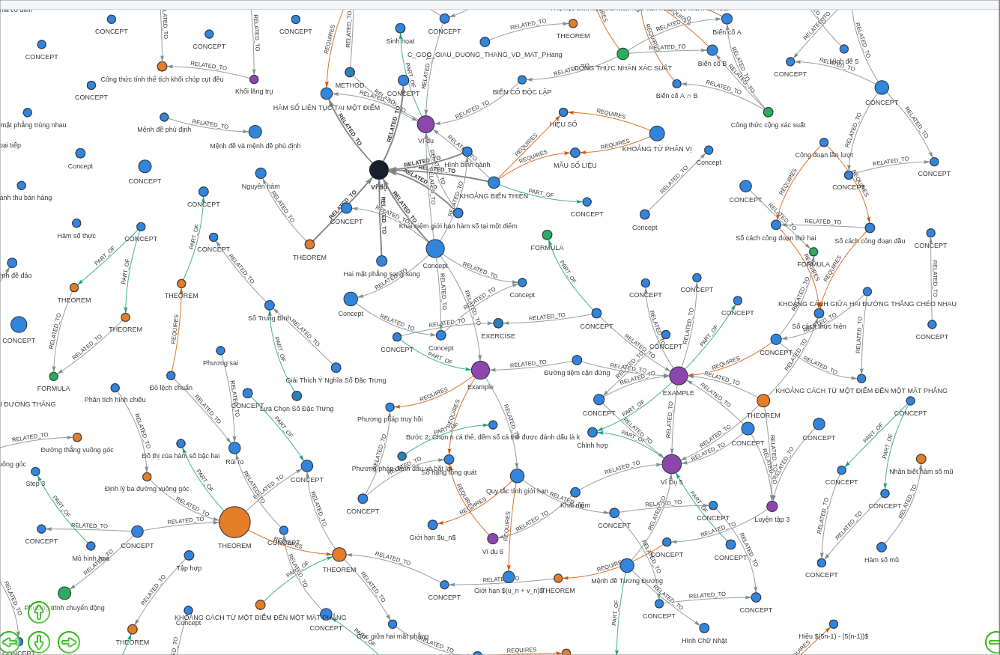

# MASTER

> **Multi-Agent System for Teaching, Evaluating & Reviewing**
> 
> An autonomous EdTech platform driven by a deeply collaborative multi-agent architecture. Designed for high school students, MASTER transcends traditional static logic by orchestrating a cohesive ecosystem of 5 specialized AI agents: the **Manager**, **Parser**, **Teacher**, **Verifier**, and **Adaptive Agent**. Exhibiting true agentic capabilities, these entities reason and collaborate dynamically to ingest complex materials, provide cognitive step-by-step hints, cross-verify AI outputs to eliminate hallucinations, and autonomously map out hyper-personalized learning paths using real-time performance data.

<p align="center">
  <a href="https://github.com/khang1108/MASTER---Multi-Agent-System-for-Teaching-Evaluating-Reviewing/stargazers"></a>
  <a href="https://nextjs.org/"></a>
  <a href="https://nestjs.com/"></a>
  <a href="https://www.python.org/"></a>
  <a href="https://azure.microsoft.com/en-us/products/container-apps"></a>
</p>

This repository constitutes the primary codebase for the MASTER system. The following sections provide an in-depth understanding of the platform's architecture, underlying technologies, deployment protocols, and knowledge graph integration processes.

## Star History

Tracking the community interest and growth of the repository over time:

[](https://star-history.com/#khang1108/MASTER---Multi-Agent-System-for-Teaching-Evaluating-Reviewing&Date)

## Overview and Core Value Proposition

MASTER is developed to address the growing need for personalized learning among high school students. It serves as a centralized repository for examination papers and practice tests categorized by subject, grade level, and exam type. The system supports entrance assessments, maintains a comprehensive history of attempted exams, and allows students to review their performance at any time. Based on previous results and individual learner profiles, MASTER generates tailored recommendations for subsequent study sessions. To ensure seamless development, testing, and deployment, the architecture is decoupled into independent services: the web interface, the API backend, and the sophisticated AI agent service. The current implementation evaluates objective tests deterministically at the API layer, while the agent service is dedicated to advanced tasks such as providing strategic hints, analyzing student mistakes, generating adaptive practice sessions, and orchestrating various AI-driven workflows.

## Key Features and User Interface

The platform offers a robust set of features designed to enhance the educational experience. Users can authenticate securely via email and password or Google OAuth. Upon logging in, students are greeted by a comprehensive dashboard that aggregates their academic profile, exam history, and overall learning performance. The exam library allows students to browse available tests, enter a simulated examination room, and submit their answers. For new students, the system can automatically generate entrance exams tailored to assess their initial proficiency. 

Furthermore, a dedicated practice mode continuously updates the student's backlog of exercises using a specialized adaptive AI agent. During practice, students can request AI-generated hints for specific questions and receive detailed explanations for their mistakes. All exam submissions are recorded in the history module, enabling students to revisit past results, review correct answers, and read question-specific feedback.




## System Architecture & Agentic Pipeline

The system architecture follows a modern, decoupled microservices pattern to guarantee scalability and maintainability, driven by an advanced multi-agent orchestration pipeline.



High school students interact with the Next.js App Router-based frontend. These frontend interactions are routed through an internal API proxy to the backend NestJS REST API, securely handling authentication, document management, exam submissions, and profile updates. This data is seamlessly persisted to a MongoDB database leveraging the Prisma ORM. For intelligent functional operations, the NestJS backend communicates with a robust Python-based AI Agent Service. This segment operates via a FastAPI endpoint and coordinates specialized cognitive agents including a Manager, Parser, Teacher, Verifier, and Adaptive logic agent, dynamically integrating Large Language Models (LLMs) and LangSmith tracing.

## Knowledge Graph Construction and Deployment

Building the educational Knowledge Graph is a foundational step in enabling the adaptive learning capabilities of MASTER. The system ingests raw educational materials, such as the digital textbooks stored within the `data/` directory (e.g., mathematics textbooks for varying high school grade levels). Constructing the graph requires initializing the data parsing pipeline located in the `data/scrapers/` module. 

By executing the configured extraction scripts, the system processes these markdown and document files, identifying key educational concepts, logical prerequisites, and learning objectives. The `Parser` AI agent systematically cross-references these newly identified concepts to establish semantic linkages, constructing a definitive network of knowledge. This resulting graph is subsequently persisted into the database, serving as the core reference model for the `Adaptive` agent. When a student takes an exam, the Adaptive agent traverses this Knowledge Graph to pinpoint the exact foundational gaps in their understanding, automatically queuing targeted practice content synchronized with their specific developmental needs.



## Usage and Local Development Instructions

To begin utilizing the platform in a local development context, Docker Compose provides the most stable methodology. Developers must first configure their environment variables by duplicating the `infra/.env.example` templates into specific file environments for the API, Web, and AI segments.

1. **Configure Environment Variables:**
```bash
cp infra/.env.example infra/.env.api
cp infra/.env.example infra/.env.web
cp infra/.env.example infra/.env.ai
```
*(Ensure you update the newly created files with your MongoDB keys, Google OAuth client secrets, and preferred LLM provider details)*

2. **Initialize the Docker Stack:**
```bash
docker compose -f infra/docker-compose-web.yml up --build
```
When the containers successfully deploy, the user interface immediately becomes accessible via the standard local port 3000, while the API health statuses can be monitored at ports 3001 and 8000 respectively.

3. **Alternative Manual Setup (Without Docker):**
Engineers seeking to focus on distinct subsystems can instantiate the services manually.

**For the Backend API (NestJS):**
```bash
cd master/apps/api
npm install
npx prisma generate
npm run start:dev
```

**For the Frontend Web (Next.js):**
```bash
cd master/apps/web
npm install
npm run dev
```

**For the AI Agent Service (Python):**
```bash
cd master/agents
pip install -r requirements.txt
pytest
```

## Comprehensive Technology Stack

| Layer              | Technology                       | Key Features & Responsibilities                                                |
| ------------------ | -------------------------------- | ------------------------------------------------------------------------------ |
| **Frontend**       | Next.js 14, React 18, TypeScript | App Router, type-safety, responsive user interface                             |
| **Backend**        | NestJS 10                        | Modular architecture, secure RESTful API, validation pipes, JWT                |
| **Database**       | MongoDB, Prisma ORM              | Relational and document-based concepts mapping, secure clustering              |
| **AI Service**     | Python 3.12, FastAPI             | Endpoint orchestration for Manager, Parser, Teacher, Verifier, Adaptive agents |
| **AI Framework**   | LangChain, LangGraph             | Complex multi-agent workflow orchestration                                     |
| **Infrastructure** | Docker, Docker Compose           | Container-native ideology, local development configuration                     |
| **Deployment**     | Azure Container Apps             | Robust execution environments, seamless transitions                            |

## Production Azure Deployment

The repository integrates an automated Continuous Integration and Continuous Deployment pipeline using GitHub Actions, tailored directly for Microsoft Azure. Triggered by a primary branch push or a manual workflow dispatch, the pipeline actively builds the distinct Docker images and securely pushes them into an Azure Container Registry (ACR).

Subsequently, the Azure Container Apps are thoroughly updated with the latest revisions alongside their isolated secure environment variables via GitHub Secrets. Required keys include Azure subscription identifiers, registry login paths, database uniform resource identifiers, and LLM access tokens. This serverless container deployment strictly guarantees isolated execution, rapid scaling capabilities during high-traffic examination periods, and built-in observability with an integrated LangSmith tracing protocol activated natively across the AI containers.

## Contributors

We welcome and appreciate all contributions to the MASTER platform. Thank you to everyone who has helped build this project!

<a href="https://github.com/khang1108/MASTER---Multi-Agent-System-for-Teaching-Evaluating-Reviewing/graphs/contributors">
  
</a>
