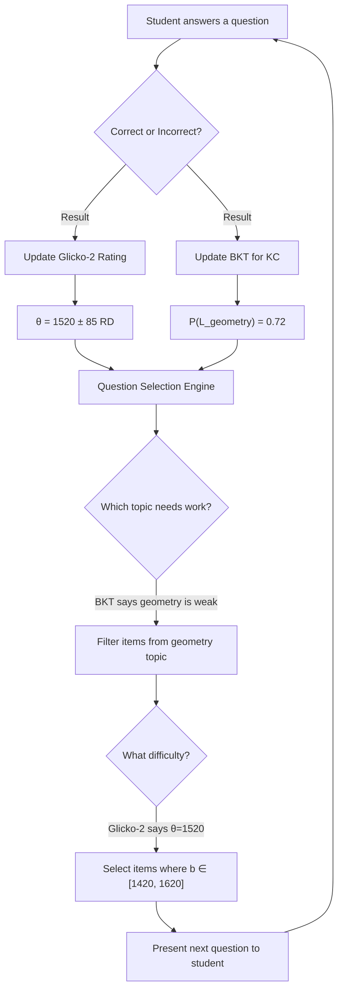

# Elo-MMR, Glicko-2 & Simplified BKT for Adaptive Learning

## MASTER — Multi-Agent System for Teaching, Evaluating & Reviewing

---

## Table of Contents

1. [Why These Algorithms?](#1-why-these-algorithms)
2. [The Elo Rating System for Education](#2-the-elo-rating-system-for-education)
3. [Glicko-2: Elo with Confidence](#3-glicko-2-elo-with-confidence)
4. [Elo-MMR: Massive Multiplayer Rating](#4-elo-mmr-massive-multiplayer-rating)
5. [Simplified BKT: Per-KC Mastery Tracking](#5-simplified-bkt-per-kc-mastery-tracking)
6. [Integration: The Combined Architecture](#6-integration-the-combined-architecture)
7. [Implementation Guide for MASTER](#7-implementation-guide-for-master)
8. [Comparison & Decision Matrix](#8-comparison--decision-matrix)
9. [References](#9-references)

---

## 1. Why These Algorithms?

The MASTER Adaptive Agent requires algorithms that satisfy three constraints simultaneously:

| Constraint | Requirement |
|:---|:---|
| **Modern** | Battle-tested in production at scale (Duolingo, Chess.com, Codeforces) |
| **Sufficient** | Implementable within 9 days for a hackathon MVP |
| **Accurate** | Mathematically equivalent to IRT for ability estimation, proven in peer-reviewed research |

The chosen stack is:

```
┌─────────────────────────────────────────────────────┐
│              ADAPTIVE AGENT ALGORITHM STACK           │
│                                                       │
│   Layer 1: GLOBAL ABILITY ESTIMATION                  │
│   ┌─────────────────────────────────────────┐        │
│   │  Elo / Glicko-2 / Elo-MMR              │        │
│   │  → "How strong is this student overall?"│        │
│   └─────────────────────────────────────────┘        │
│                                                       │
│   Layer 2: PER-TOPIC MASTERY TRACKING                │
│   ┌─────────────────────────────────────────┐        │
│   │  Simplified BKT (per Knowledge Comp.)   │        │
│   │  → "Has this student mastered algebra?" │        │
│   └─────────────────────────────────────────┘        │
│                                                       │
│   Layer 3: QUESTION SELECTION                         │
│   ┌─────────────────────────────────────────┐        │
│   │  Elo-based difficulty targeting + ZPD   │        │
│   │  → "What question should come next?"    │        │
│   └─────────────────────────────────────────┘        │
└─────────────────────────────────────────────────────┘
```

> [!IMPORTANT]
> The key insight is that **Elo is mathematically equivalent to a simplified IRT model** but operates **online** (updates after every single response) rather than requiring batch calibration. This was formally demonstrated by Pelánek (2016) in *Computers & Education* (**Q1 journal, IF ≈ 12.0**).

---

## 2. The Elo Rating System for Education

### 2.1 Origin and Adaptation

The Elo system was invented by Arpad Elo (1978) for chess rating. In the educational context, the critical innovation is treating a **student answering a question** as a **match** between two players:

- **Player A** = The Student (rating = ability θ)
- **Player B** = The Question (rating = difficulty b)
- **Result** = Correct (student "wins") or Incorrect (question "wins")

> **Pelánek, R. (2016).** Applications of the Elo rating system in adaptive educational systems. *Computers & Education*, 98, 169–179.
> — **Q1 Journal** (Elsevier, IF ≈ 12.0). The foundational paper for Elo in education.

### 2.2 Mathematical Formulation

#### Expected Probability of Correct Response

$$E_{student} = P(\text{correct}) = \frac{1}{1 + 10^{(b - \theta) / 400}}$$

where:
- θ = student's current Elo rating (ability)
- b = question's current Elo rating (difficulty)
- 400 = scaling constant (a difference of 400 Elo points ≈ 10× likelihood ratio)

> [!NOTE]
> This is **mathematically identical** to the 1PL IRT (Rasch) model with scale factor D = ln(10)/400 ≈ 0.00576. The Elo formulation simply uses base-10 instead of base-e:
>
> **IRT:** $P = \frac{1}{1 + e^{-(\theta - b)}}$
>
> **Elo:** $P = \frac{1}{1 + 10^{-(θ - b)/400}}$
>
> They are equivalent under the transformation: $\theta_{IRT} = \theta_{Elo} \times \frac{\ln 10}{400}$

#### Rating Update Rule

After the student responds (S = 1 if correct, S = 0 if incorrect):

**Student update:**

$$\theta_{new} = \theta_{old} + K_s \cdot (S - E_{student})$$

**Question difficulty update (optional but recommended):**

$$b_{new} = b_{old} + K_q \cdot (E_{student} - S)$$

Note: the question update is the **mirror** of the student update — when the student "wins" (correct answer), the question gets "easier" (difficulty decreases) and vice versa.

#### The K-Factor

K controls the **sensitivity** of updates. Choosing K wisely is crucial:

| Context | K value | Rationale |
|:---|:---:|:---|
| New student (< 30 responses) | 40–60 | High volatility, need to converge quickly |
| Established student (30–100) | 20–30 | Moderate responsiveness |
| Stable student (100+) | 10–20 | Resist noise, reflect steady improvement |
| Question difficulty | 5–10 | Items should be stable, change slowly |

A common strategy is a **decaying K-factor**:

$$K(n) = \frac{K_{max}}{1 + \alpha \cdot n}$$

where n = number of responses and α controls decay speed. This ensures:
- **Fast convergence** for new students (cold start)
- **Stability** for established students

### 2.3 Worked Example

A student with θ = 1500 answers a question with b = 1600:

```
Step 1: Expected score
  E = 1 / (1 + 10^((1600-1500)/400))
  E = 1 / (1 + 10^(0.25))
  E = 1 / (1 + 1.778)
  E = 0.360  (36% chance of getting it right)

Step 2a: If CORRECT (S=1), K=30
  θ_new = 1500 + 30 × (1 - 0.360) = 1500 + 19.2 = 1519
  b_new = 1600 + 10 × (0.360 - 1) = 1600 - 6.4 = 1594

Step 2b: If INCORRECT (S=0), K=30
  θ_new = 1500 + 30 × (0 - 0.360) = 1500 - 10.8 = 1489
  b_new = 1600 + 10 × (0.360 - 0) = 1600 + 3.6 = 1604
```

Key observations:
- Answering a **hard** question correctly gives a **big** boost (+19.2)
- Answering a **hard** question wrong gives a **small** penalty (-10.8)
- The system rewards students for attempting challenges and doesn't punish heavily for expected failures

### 2.4 Multi-Dimensional Elo (MELO)

For MASTER, where students are assessed across multiple subjects (Math, Literature, Physics, etc.), we can maintain **separate Elo ratings per subject** or per **knowledge domain**:

```python
student_ratings = {
    "math.algebra":       1520,
    "math.geometry":      1380,
    "math.calculus":      1610,
    "math.trigonometry":  1450,
    "math.statistics":    1500,  # default for new topic
}
```

Each topic rating evolves independently via the Elo update rule. This is equivalent to **multidimensional IRT (MIRT)** but far simpler to implement.

> **Pelánek, R., Rihák, J., & Papoušek, J. (2017).** Impact of data collection on interpretation and evaluation of student models. *Proceedings of the 6th International Conference on Learning Analytics & Knowledge (LAK)*, pp. 40–49.
> — **Conference Ranking:** A (CORE)

### 2.5 Bootstrapping Question Difficulty

A critical advantage of Elo over traditional IRT is that question difficulties **self-calibrate**:

1. **Initialize** all new questions at b = 1500 (average difficulty)
2. As students interact with the question, the difficulty adjusts:
   - If mostly high-ability students get it wrong → difficulty increases
   - If mostly low-ability students get it right → difficulty decreases
3. After ~30–50 student responses, the question difficulty converges to a stable value

This eliminates the need for expensive **pre-testing** or **expert calibration** that traditional IRT requires.

### 2.6 Advantages and Limitations

| ✅ Advantages | ❌ Limitations |
|:---|:---|
| Online learning: updates after every response | No built-in confidence measure (see Glicko-2) |
| Self-calibrating item difficulties | Assumes unidimensionality per rating |
| Mathematically equivalent to Rasch/1PL IRT | No discrimination parameter (see 2PL IRT) |
| Computationally trivial: O(1) per update | K-factor needs tuning |
| Proven at scale (Duolingo, Chess.com) | Rating inflation can occur over time |
| No pre-testing of items required | Initial estimates are noisy |

---

## 3. Glicko-2: Elo with Confidence

### 3.1 Motivation

The primary weakness of Elo is that a rating of 1500 for a new student (0 responses) looks identical to 1500 for a veteran student (500 responses). **Glicko-2** solves this by adding two parameters that quantify uncertainty.

> **Glickman, M. E. (2001).** Dynamic paired comparison models with stochastic variances. *Journal of Applied Statistics*, 28(6), 673–689.
> — **Q2 Journal** (Taylor & Francis)

> **Glickman, M. E. (2013).** Example of the Glicko-2 system. Technical Report. Boston University. Available at: http://www.glicko.net/glicko/glicko2.pdf
> — Official algorithm specification

### 3.2 Three Parameters

Every student and every question is characterized by:

| Parameter | Symbol | Description | Initial Value |
|:---|:---:|:---|:---:|
| **Rating** | r | Estimated ability/difficulty | 1500 |
| **Rating Deviation (RD)** | φ | Uncertainty in the rating (lower = more confident) | 350 |
| **Volatility** | σ | Expected degree of rating fluctuation | 0.06 |

The **95% confidence interval** for a student's true ability is approximately:

$$\text{True ability} \in [r - 2 \times RD, \; r + 2 \times RD]$$

For a new student: [1500 - 700, 1500 + 700] = [800, 2200] → very uncertain
After 50 responses: [1450 - 100, 1450 + 100] = [1350, 1550] → much more precise

### 3.3 The Glicko-2 Algorithm

#### Step 0: Scale Conversion

Glicko-2 operates on an internal scale (μ, φ) for numerical stability:

$$\mu = \frac{r - 1500}{173.7178}, \quad \phi = \frac{RD}{173.7178}$$

#### Step 1: Helper Functions

**g-function** (reduces opponent's influence based on their uncertainty):

$$g(\phi_j) = \frac{1}{\sqrt{1 + \frac{3\phi_j^2}{\pi^2}}}$$

**E-function** (expected score, analogous to Elo):

$$E(\mu, \mu_j, \phi_j) = \frac{1}{1 + \exp\left(-g(\phi_j)(\mu - \mu_j)\right)}$$

In educational context: μ = student ability, μ_j = question difficulty, φ_j = uncertainty of question difficulty.

#### Step 2: Compute Estimated Variance (v)

After a rating period (batch of n questions answered):

$$v = \left[\sum_{j=1}^{n} g(\phi_j)^2 \cdot E_j \cdot (1 - E_j)\right]^{-1}$$

This is the **inverse Fisher Information** — directly related to the CAT concept of measurement precision.

#### Step 3: Compute Estimated Improvement (Δ)

$$\Delta = v \sum_{j=1}^{n} g(\phi_j) \cdot (s_j - E_j)$$

where s_j ∈ {0, 1} is the actual outcome (incorrect/correct).

#### Step 4: Update Volatility (σ')

The new volatility σ' is found by solving the following equation iteratively (using the Illinois algorithm or bisection):

$$f(x) = \frac{e^x(\Delta^2 - \phi^2 - v - e^x)}{2(\phi^2 + v + e^x)^2} - \frac{x - \ln(\sigma^2)}{\tau^2} = 0$$

where τ is a system constant (recommended: 0.3–1.2). **For the MASTER MVP, τ = 0.5 is a safe default.**

> [!TIP]
> The volatility update is the most complex part of Glicko-2. For the hackathon MVP, you can **simplify by using fixed volatility** (σ = 0.06) and only updating r and RD. This reduces Glicko-2 to effectively Glicko-1, which is still a major improvement over bare Elo.

#### Step 5: Update Rating Deviation

$$\phi^* = \sqrt{\phi^2 + \sigma'^2}$$

$$\phi' = \frac{1}{\sqrt{\frac{1}{\phi^{*2}} + \frac{1}{v}}}$$

#### Step 6: Update Rating

$$\mu' = \mu + \phi'^2 \sum_{j=1}^{n} g(\phi_j)(s_j - E_j)$$

#### Step 7: Convert Back

$$r' = 173.7178\mu' + 1500, \quad RD' = 173.7178\phi'$$

### 3.4 Handling Inactivity

If a student hasn't practiced for a period, only the RD increases:

$$\phi' = \sqrt{\phi^2 + \sigma^2}$$

This means:
- An inactive student's rating **stays the same** but becomes **less certain**
- When they return, the system adapts **faster** (higher RD → larger updates)
- This perfectly models the intuition that we're less sure about an inactive student's current ability

### 3.5 Glicko-2 Educational Adaptations

For MASTER's educational context, we make several adaptations:

| Standard Glicko-2 | MASTER Adaptation |
|:---|:---|
| Rating periods (batch updates) | **Per-response updates** (online mode) — set rating period = 1 question |
| Two-player games | **Student vs. Question** framing |
| Win/Loss/Draw | **Correct/Incorrect** (no draws) |
| Opponent RD matters | Question RD reflects **calibration confidence** |
| Rating can go negative | **Floor at 100** (avoid discouraging students) |

### 3.6 Why Glicko-2 over Bare Elo for MASTER

| Feature | Elo | Glicko-2 |
|:---|:---:|:---:|
| Ability estimation | ✅ | ✅ |
| Confidence measure | ❌ | ✅ (RD) |
| Handles inactivity | ❌ | ✅ (RD increases) |
| Adapts to erratic performance | ❌ | ✅ (volatility σ) |
| Cold start handling | K-factor heuristic | Built-in (high RD) |
| Implementation complexity | ~30 lines | ~80 lines |
| Question calibration confidence | ❌ | ✅ (question has own RD) |

> [!IMPORTANT]
> **Recommendation for MASTER:** Use **Glicko-2** as the primary rating system. The RD parameter is invaluable — it tells the Adaptive Agent exactly **how confident** it should be about each student's ability, which directly informs the question selection strategy.

---

## 4. Elo-MMR: Massive Multiplayer Rating

### 4.1 Overview

Elo-MMR is a modern Bayesian rating system designed for competitions with many simultaneous participants.

> **Ebtekar, A., & Liu, P. (2021).** Elo-MMR: A Rating System for Massive Multiplayer Competitions. *Proceedings of The Web Conference (WWW '21)*, pp. 1772–1784. ACM.
> — **Conference Ranking:** A* (CORE)

### 4.2 The MMR Properties

| Property | Description |
|:---|:---|
| **Massive** | Supports any number of participants; O(n log n) runtime per competition |
| **Monotonic** | Incentive-compatible — students can never gain by deliberately performing worse |
| **Robust** | Rating changes are bounded; prevents extreme rating jumps from flukes |

### 4.3 Mathematical Foundation

Elo-MMR models each participant i with a latent skill μᵢ and a performance noise term:

$$\text{performance}_i = \mu_i + \epsilon_i, \quad \epsilon_i \sim \text{Logistic}(0, \beta)$$

The rating is updated using a Bayesian posterior approximation:

$$\mu_i^{new} = \mu_i^{old} + \frac{\delta_i}{\rho_i}$$

where:
- **δᵢ** = gradient of the log-posterior (direction of update)
- **ρᵢ** = curvature of the log-posterior (confidence-weighted step size)

For a competition where participant i placed rank rᵢ among N participants:

$$\delta_i = \sum_{j \neq i} \text{sign}(r_j - r_i) \cdot \frac{1}{1 + e^{|\mu_i - \mu_j|/\beta}}$$

### 4.4 Application in MASTER: Contest Mode

While Elo-MMR is overkill for individual practice (use Glicko-2), it becomes highly relevant for MASTER's **future Contest/Competition features**:

| Use Case | Rating System |
|:---|:---|
| Individual practice & exams | **Glicko-2** |
| Timed competitions (multiple students) | **Elo-MMR** |
| Leaderboards & ranking | **Elo-MMR** |

When MASTER implements the "Contest" feature (post-hackathon goal mentioned in Section 5.1 of the proposal), Elo-MMR enables:
- Fair ranking of all students taking the same timed exam
- Incentive-compatible scoring (no benefit from sandbagging)
- Efficient batch processing of contest results

### 4.5 Simplified Elo-MMR for Two-Player (Student vs Question)

When reduced to the two-player case (student vs question), Elo-MMR simplifies to:

$$\mu_{student}' = \mu_{student} + \frac{S - E}{\rho_{student}}, \quad \rho_{student} = 1 + \frac{1}{\sigma_{student}^2}$$

where σ²_student is the posterior variance. This is functionally equivalent to **Glicko** with the RD playing the role of σ.

> [!NOTE]
> **For the hackathon MVP, use Glicko-2 for all individual interactions.** Reserve Elo-MMR for when you implement the Contest feature. Both systems are compatible — a student's Glicko-2 rating can be used as the prior μ for Elo-MMR in contest mode.

---

## 5. Simplified BKT: Per-KC Mastery Tracking

### 5.1 Why BKT in Addition to Elo/Glicko-2?

Elo/Glicko-2 gives you a **single number** per topic/subject. But education requires more granularity:

| Question | Elo/Glicko-2 Answers | BKT Answers |
|:---|:---:|:---:|
| "How strong is the student in Math?" | ✅ (rating = 1520) | ❌ |
| "Has the student mastered derivatives?" | ❌ | ✅ (P(L) = 0.92) |
| "Is the student still learning trig?" | ❌ | ✅ (P(L) = 0.35) |
| "When should we stop drilling this topic?" | ❌ | ✅ (when P(L) > 0.95) |

**The combination is powerful:**
- **Elo/Glicko-2** → decides the **difficulty level** of the next question
- **BKT** → decides the **topic** of the next question

### 5.2 Simplified BKT Model

For the MASTER MVP, we use BKT with **fixed default parameters** (no EM fitting):

#### Parameters

| Parameter | Symbol | Default Value | Justification |
|:---|:---:|:---:|:---|
| Prior Knowledge | P(L₀) | 0.20 | Conservative: assume students start with low mastery |
| Learn Rate | P(T) | 0.10 | Moderate: 10% chance of learning per attempt |
| Slip | P(S) | 0.05 | Low: if you know it, you rarely mess up |
| Guess | P(G) | 0.25 | 4-option MCQ → 25% random guess rate |

> [!TIP]
> For **essay/free-response questions** (not MCQ), set P(G) = 0.05 (much harder to guess correctly). For **true/false questions**, set P(G) = 0.50.

#### Update Equations

```python
def bkt_update(P_L: float, correct: bool, 
               P_T=0.10, P_S=0.05, P_G=0.25) -> float:
    """
    Update BKT mastery estimate for a single Knowledge Component.
    
    Args:
        P_L: Current mastery probability P(Lₙ₋₁)
        correct: Whether the student answered correctly
        P_T: Learning transition probability
        P_S: Slip probability
        P_G: Guess probability
    
    Returns:
        Updated mastery probability P(Lₙ)
    """
    if correct:
        # Posterior: P(knew | correct)
        numerator = P_L * (1 - P_S)
        denominator = P_L * (1 - P_S) + (1 - P_L) * P_G
    else:
        # Posterior: P(knew | incorrect)
        numerator = P_L * P_S
        denominator = P_L * P_S + (1 - P_L) * (1 - P_G)
    
    P_L_posterior = numerator / denominator
    
    # Learning transition: even if you didn't know before, 
    # you might have learned from the attempt
    P_L_new = P_L_posterior + (1 - P_L_posterior) * P_T
    
    return P_L_new
```

### 5.3 Mastery Lifecycle

```
P(L) = 0.20  ──[correct]──▶  P(L) = 0.54  ──[correct]──▶  P(L) = 0.79
     │                             │                             │
     └──[incorrect]──▶ P(L) = 0.13  └──[incorrect]──▶ P(L) = 0.44

... After several correct responses:

P(L) = 0.95+ → ✅ MASTERED (stop drilling this KC)
```

### 5.4 Tracking Multiple Knowledge Components

```python
# Student mastery profile (stored in database)
student_mastery = {
    "calculus.derivative":           0.92,  # ✅ Mastered
    "calculus.integral":             0.78,  # 🟡 Learning
    "calculus.differential_eq":      0.20,  # 🔴 Not started
    "algebra.quadratic":             0.95,  # ✅ Mastered  
    "algebra.polynomial":            0.85,  # 🟡 Almost mastered
    "geometry.triangle":             0.45,  # 🔴 Weak
    "geometry.circle":               0.20,  # 🔴 Not started
    "trigonometry.basic":            0.60,  # 🟡 Learning
    "trigonometry.identity":         0.30,  # 🔴 Weak
}

# After each question response:
kc = question.knowledge_component  # e.g., "geometry.triangle"
student_mastery[kc] = bkt_update(student_mastery[kc], was_correct)
```

### 5.5 Mastery Thresholds and Actions

| Mastery Level | P(L) Range | Status | Agent Action |
|:---|:---:|:---:|:---|
| Not Started | < 0.30 | 🔴 | Introduce with scaffolding, easy questions |
| Weak | 0.30 – 0.60 | 🟠 | Prioritize for practice, medium difficulty |
| Learning | 0.60 – 0.85 | 🟡 | Continue practice, increase difficulty |
| Almost Mastered | 0.85 – 0.95 | 🟢 | Final consolidation, harder questions |
| Mastered | > 0.95 | ✅ | Move to next KC, schedule FSRS review |

### 5.6 Simplified BKT with Forgetting

For the MASTER system, we add a simple **forgetting mechanism** that decays mastery over time:

```python
def apply_forgetting(P_L: float, days_since_last_practice: int, 
                     P_F_per_day=0.02) -> float:
    """
    Apply time-based forgetting to mastery estimate.
    
    Args:
        P_L: Current mastery probability
        days_since_last_practice: Days since this KC was last practiced
        P_F_per_day: Daily forgetting rate (probability of forgetting per day)
    
    Returns:
        Decayed mastery probability
    """
    if days_since_last_practice == 0:
        return P_L
    
    # Exponential decay
    retention = (1 - P_F_per_day) ** days_since_last_practice
    P_L_decayed = P_L * retention + 0.05 * (1 - retention)  # floor at 0.05
    
    return P_L_decayed
```

This means:
- A mastered KC (P(L) = 0.95) decays to ~0.78 after 10 days without practice
- A weakly learned KC (P(L) = 0.60) decays to ~0.50 after 10 days
- The Adaptive Agent can proactively schedule reviews for decaying KCs

---

## 6. Integration: The Combined Architecture

### 6.1 How the Pieces Fit Together



### 6.2 Complete Update Cycle in Python

```python
class AdaptiveAgent:
    def __init__(self, student_id: str):
        self.student_id = student_id
        
        # Glicko-2 parameters (global ability)
        self.rating = 1500.0        # r
        self.rd = 350.0             # RD (high for new students)
        self.volatility = 0.06      # σ
        
        # BKT mastery per Knowledge Component
        self.mastery = {}           # {kc_name: P(L)}
        
        # BKT defaults
        self.P_T = 0.10
        self.P_S = 0.05
        self.P_G = 0.25
        self.P_L0 = 0.20
    
    def process_response(self, question, correct: bool):
        """Process a student response and update all models."""
        
        # === LAYER 1: Update Glicko-2 (global ability) ===
        self._update_glicko2(question.difficulty, question.rd, correct)
        
        # === LAYER 2: Update BKT (per-KC mastery) ===
        kc = question.knowledge_component
        if kc not in self.mastery:
            self.mastery[kc] = self.P_L0
        
        self.mastery[kc] = self._update_bkt(self.mastery[kc], correct)
        
        # === LAYER 3: Determine next action ===
        return self._select_next_question()
    
    def _update_glicko2(self, q_rating, q_rd, correct):
        """Simplified Glicko-2 update (single-game rating period)."""
        # Convert to Glicko-2 scale
        mu = (self.rating - 1500) / 173.7178
        phi = self.rd / 173.7178
        mu_j = (q_rating - 1500) / 173.7178
        phi_j = q_rd / 173.7178
        
        # Helper functions
        import math
        g_phi_j = 1 / math.sqrt(1 + 3 * phi_j**2 / math.pi**2)
        E = 1 / (1 + math.exp(-g_phi_j * (mu - mu_j)))
        
        # Variance
        v = 1 / (g_phi_j**2 * E * (1 - E))
        
        # Update volatility (simplified: keep constant for MVP)
        sigma_new = self.volatility
        
        # Update RD
        phi_star = math.sqrt(phi**2 + sigma_new**2)
        phi_new = 1 / math.sqrt(1/phi_star**2 + 1/v)
        
        # Update rating
        s = 1.0 if correct else 0.0
        mu_new = mu + phi_new**2 * g_phi_j * (s - E)
        
        # Convert back
        self.rating = 173.7178 * mu_new + 1500
        self.rd = 173.7178 * phi_new
        self.volatility = sigma_new
    
    def _update_bkt(self, P_L, correct):
        """BKT posterior + learning transition."""
        if correct:
            posterior = (P_L * (1 - self.P_S)) / \
                       (P_L * (1 - self.P_S) + (1 - P_L) * self.P_G)
        else:
            posterior = (P_L * self.P_S) / \
                       (P_L * self.P_S + (1 - P_L) * (1 - self.P_G))
        
        return posterior + (1 - posterior) * self.P_T
    
    def _select_next_question(self):
        """Select the next optimal question."""
        # Step 1: Find weakest KCs (BKT)
        weak_kcs = sorted(
            [(kc, p) for kc, p in self.mastery.items() if p < 0.95],
            key=lambda x: x[1]
        )
        
        if not weak_kcs:
            return {"action": "ALL_MASTERED", "message": "Great job!"}
        
        target_kc = weak_kcs[0][0]  # Weakest KC
        
        # Step 2: Target difficulty (Glicko-2)
        # ZPD: slightly above current ability
        target_difficulty = self.rating + 50  # +50 Elo = ~57% expected accuracy
        difficulty_range = (self.rating - 100, self.rating + 200)
        
        return {
            "action": "NEXT_QUESTION",
            "target_kc": target_kc,
            "target_difficulty": target_difficulty,
            "difficulty_range": difficulty_range,
            "confidence": max(0, 1 - self.rd/350),  # 0=uncertain, 1=confident
        }
```

### 6.3 Question Selection: The ZPD Sweet Spot

```
                        ZPD (Zone of Proximal Development)
                    ┌───────────────────────────────────────┐
                    │                                       │
    Too Easy        │   PRODUCTIVE STRUGGLE ZONE            │    Too Hard
    (Boring)        │                                       │    (Frustrating)
                    │   ★ Target: θ + 50 to θ + 150        │
  ◄─────────────────┼───────────────────────────────────────┼──────────────────►
  θ-200         θ-100          θ          θ+100         θ+200         θ+300
                    │                                       │
                    │  P(correct) ≈ 60-75%                  │
                    │  Maximum learning occurs here         │
                    └───────────────────────────────────────┘
```

The optimal difficulty targeting:
- **P(correct) ≈ 70%** is the sweet spot for learning (not too easy, not too hard)
- In Elo terms: target questions where |b - θ| ≈ 50-150 Elo points above student rating
- Glicko-2's RD tells us how **wide** to make the difficulty range:
  - High RD (uncertain) → wider range (explore more)
  - Low RD (confident) → narrower range (exploit the estimate)

---

## 7. Implementation Guide for MASTER

### 7.1 Database Schema

```sql
-- Student ability tracking (Glicko-2)
CREATE TABLE student_ratings (
    student_id      UUID PRIMARY KEY,
    subject         VARCHAR(50),        -- 'math', 'literature', etc.
    rating          FLOAT DEFAULT 1500,
    rd              FLOAT DEFAULT 350,  -- Rating Deviation
    volatility      FLOAT DEFAULT 0.06,
    total_responses INT DEFAULT 0,
    last_active     TIMESTAMP DEFAULT NOW(),
    UNIQUE(student_id, subject)
);

-- BKT mastery per Knowledge Component
CREATE TABLE student_mastery (
    student_id      UUID,
    kc_id           VARCHAR(100),       -- 'calculus.derivative'
    mastery_prob    FLOAT DEFAULT 0.20, -- P(L)
    attempts        INT DEFAULT 0,
    correct_count   INT DEFAULT 0,
    last_practiced  TIMESTAMP,
    PRIMARY KEY(student_id, kc_id)
);

-- Question difficulty (self-calibrating)
CREATE TABLE question_ratings (
    question_id     UUID PRIMARY KEY,
    kc_id           VARCHAR(100),
    difficulty      FLOAT DEFAULT 1500, -- Elo difficulty rating
    rd              FLOAT DEFAULT 350,  -- Uncertainty in difficulty
    times_answered  INT DEFAULT 0,
    correct_rate    FLOAT DEFAULT 0.5
);
```

### 7.2 API Endpoints

```
POST /api/adaptive/process-response
  Body: { student_id, question_id, correct: bool }
  Returns: { updated_rating, updated_mastery, next_question }

GET  /api/adaptive/next-question?student_id=X
  Returns: { question_id, topic, difficulty, expected_accuracy }

GET  /api/adaptive/student-profile?student_id=X
  Returns: { rating, rd, mastery_map, weak_topics, learning_path }
```

### 7.3 Implementation Priority Order

| Priority | Component | Effort | Impact |
|:---:|:---|:---:|:---:|
| **P0** | Elo update for student ability | 2h | 🔥🔥🔥 |
| **P0** | BKT update per KC | 2h | 🔥🔥🔥 |
| **P1** | Difficulty-based question selection | 3h | 🔥🔥🔥 |
| **P1** | Weak-KC prioritization | 2h | 🔥🔥 |
| **P2** | Upgrade Elo → Glicko-2 (add RD) | 4h | 🔥🔥 |
| **P2** | Question difficulty self-calibration | 2h | 🔥🔥 |
| **P3** | Forgetting mechanism | 1h | 🔥 |
| **P3** | ZPD width based on RD | 1h | 🔥 |
| **P4** | Elo-MMR for contest mode | 8h | 🔥 (post-MVP) |

---

## 8. Comparison & Decision Matrix

### 8.1 Algorithm Comparison for MASTER's Needs

| Criterion | Bare Elo | Glicko-2 | Elo-MMR | Full IRT (2PL) | DKT |
|:---|:---:|:---:|:---:|:---:|:---:|
| **Implementation time** | 2h | 4h | 8h | 2d+ | 1w+ |
| **No pre-calibration needed** | ✅ | ✅ | ✅ | ❌ | ❌ |
| **Cold start handling** | 🟡 | ✅ | ✅ | 🟡 | ❌ |
| **Confidence estimation** | ❌ | ✅ | ✅ | ✅ | ❌ |
| **Handles inactivity** | ❌ | ✅ | ❌ | ❌ | ❌ |
| **Contest/ranking mode** | ❌ | ❌ | ✅ | ❌ | ❌ |
| **Production proven** | Chess.com | FIDE, Lichess | Codeforces | ETS exams | Research |
| **Data requirement** | Low | Low | Medium | High | Very High |
| **Math complexity** | Basic | Moderate | Moderate | Moderate | High |
| **Interpretability** | ✅ | ✅ | ✅ | ✅ | ❌ |

### 8.2 Final Recommendation for MASTER MVP

```
┌──────────────────────────────────────────────┐
│           MASTER MVP (9 days)                 │
│                                               │
│   ✅ USE:  Glicko-2 + Simplified BKT         │
│   📌 LATER: Elo-MMR (when contests added)    │
│   ❌ SKIP:  Full IRT, DKT, DKVMN, AKT       │
│                                               │
│   This gives you:                             │
│   • Global ability with confidence (Glicko-2)│
│   • Per-KC mastery tracking (BKT)            │
│   • Smart question selection (Elo targeting) │
│   • Cold start handling (high RD)            │
│   • Self-calibrating item difficulty         │
│   • ~200 lines of core Python code           │
│                                               │
└──────────────────────────────────────────────┘
```

---

## 9. References

### Core Papers (Ranked by Relevance to MASTER)

| # | Reference | Venue | Ranking |
|:---|:---|:---|:---:|
| **[1]** | Pelánek, R. (2016). Applications of the Elo rating system in adaptive educational systems. *Computers & Education*, 98, 169–179. | C&E | **Q1** (IF ≈ 12.0) |
| **[2]** | Glickman, M. E. (2001). Dynamic paired comparison models with stochastic variances. *Journal of Applied Statistics*, 28(6), 673–689. | JAS | **Q2** |
| **[3]** | Ebtekar, A., & Liu, P. (2021). Elo-MMR: A Rating System for Massive Multiplayer Competitions. *WWW '21*, 1772–1784. | WWW | **A*** |
| **[4]** | Corbett, A. T., & Anderson, J. R. (1994). Knowledge tracing: Modeling the acquisition of procedural knowledge. *UMUAI*, 4(4), 253–278. | UMUAI | **Q1** |
| **[5]** | Settles, B., & Meeder, B. (2016). A Trainable Spaced Repetition Model for Language Learning. *ACL*, 1848–1858. | ACL | **A*** |
| **[6]** | Pelánek, R., Rihák, J., & Papoušek, J. (2017). Impact of data collection on interpretation and evaluation of student models. *LAK '17*, 40–49. | LAK | **A** |
| **[7]** | Elo, A. E. (1978). *The Rating System in Chess*. Arco Publishing. | Book | Foundational |
| **[8]** | Glickman, M. E. (2013). Example of the Glicko-2 system. Technical Report, Boston University. | Report | Official Spec |
| **[9]** | Lv, R., et al. (2025). GenAL: Generative Agent for Adaptive Learning. *AAAI*, 39(1), 577–585. | AAAI | **A*** |
| **[10]** | Piech, C., et al. (2015). Deep Knowledge Tracing. *NeurIPS*, 28. | NeurIPS | **A*** |

### Duolingo's Production Systems

| # | Reference | Description |
|:---|:---|:---|
| **[11]** | Duolingo Research — Birdbrain | IRT-inspired Elo system for real-time ability estimation at scale |
| **[12]** | Duolingo Research — Half-Life Regression (HLR) | Spaced repetition model combining forgetting curves with ML |

---

> [!NOTE]
> This document provides everything needed to implement the Adaptive Agent's core algorithms for the MASTER hackathon MVP. The Glicko-2 + Simplified BKT stack is **production-proven**, **academically grounded**, and **implementable in under a week**.
