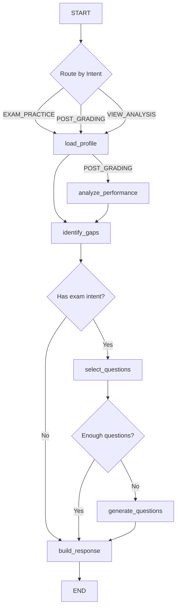

# Adaptive Learning Agent — Implementation Plan

> **For agentic workers:** REQUIRED: Use superpowers:subagent-driven-development (if subagents available) or superpowers:executing-plans to implement this plan. Steps use checkbox (`- [ ]`) syntax for tracking.

**Goal:** Xây dựng hệ thống Adaptive Learning Agent tích hợp Knowledge Graph, BKT/IRT, SAINT+ và LangGraph để tạo learner profile và sinh câu hỏi cá nhân hóa qua LLM.

**Architecture:** Hệ thống gồm 5 subsystem: (1) Knowledge Graph biểu diễn cây kiến thức Toán THPT, (2) BKT/IRT engine cập nhật mastery real-time, (3) SAINT+ model dự đoán xác suất trả lời đúng dựa trên lịch sử tương tác, (4) LangGraph Adaptive Agent điều phối tất cả model để duy trì learner profile, (5) LLM Question Generator sinh câu hỏi thích ứng. Hybrid strategy: IRT khởi tạo → BKT cập nhật per-KC → SAINT+ dự đoán sequence-level → LLM sinh đề.

**Tech Stack:** Python 3.11+, PyTorch, LangGraph, LangChain, NetworkX, Pydantic, FastAPI, PostgreSQL

---

## User Review Required

> [!IMPORTANT]
> **Scope:** Plan này bao gồm **5 subsystem** lớn. Đề xuất implement theo thứ tự: KG → BKT/IRT → SAINT+ → LangGraph Agent → LLM Question Gen. Mỗi subsystem có thể test độc lập.

> [!WARNING]
> **SAINT+ Training Data:** SAINT+ gốc dùng EdNet dataset (tiếng Anh, ~90M interactions). Với MASTER, ban đầu sẽ dùng **pre-trained weights từ EdNet** và fine-tune dần với dữ liệu Vietnamese khi tích lũy đủ. Giai đoạn MVP, SAINT+ chạy inference-only với weights sẵn có.

> [!IMPORTANT]
> **Database:** Plan này sử dụng các bảng `mastery_scores`, `irt_profiles`, `knowledge_nodes` đã được định nghĩa trong [COORDINATION.md](file:///home/phuckhang/MyWorkspace/GDGoC_HackathonVietnam/docs/COORDINATION.md) — và thêm bảng mới `student_interactions` cho SAINT+.

---

## Proposed Changes

Tổng quan file structure mới và file cần modify:

```
master/
├── data/
│   └── knowledge/
│       ├── knowledge_graph.py          [MODIFY] — KG engine với NetworkX
│       ├── skill.json                  [MODIFY] — KC taxonomy cho Toán 10-12
│       ├── math_10_kg.json             [NEW] — KG data Toán 10
│       ├── math_11_kg.json             [NEW] — KG data Toán 11
│       └── math_12_kg.json             [NEW] — KG data Toán 12
│
├── agents/
│   ├── adaptive/
│   │   ├── __init__.py                 [NEW]
│   │   ├── service.py                  [MODIFY] — AdaptiveService chính
│   │   ├── bkt.py                      [NEW] — BKT engine
│   │   ├── irt.py                      [NEW] — IRT engine
│   │   ├── cat.py                      [NEW] — CAT question selector
│   │   ├── saint_plus/
│   │   │   ├── __init__.py             [NEW]
│   │   │   ├── config.py              [NEW] — SAINT+ config (adapted)
│   │   │   ├── model.py              [NEW] — SAINT+ PyTorch model
│   │   │   ├── dataset.py            [NEW] — SAINT+ dataset adapter
│   │   │   ├── inference.py          [NEW] — SAINT+ inference engine
│   │   │   └── train.py              [NEW] — SAINT+ training script
│   │   ├── hybrid_strategy.py          [NEW] — BKT+IRT+SAINT+ fusion
│   │   ├── learner_profile_builder.py  [NEW] — Build LearnerProfile
│   │   ├── question_generator.py       [NEW] — LLM-based question gen
│   │   └── graph.py                    [NEW] — LangGraph adaptive graph
│   │
│   └── common/
│       ├── learner_profile.py          [MODIFY] — LearnerProfile schema
│       └── state.py                    [MODIFY] — Add adaptive state fields
│
└── common/
    └── model.py                        [MODIFY] — Add interaction models

tests/
├── test_knowledge_graph.py             [NEW]
├── test_bkt.py                         [NEW]
├── test_irt.py                         [NEW]
├── test_saint_plus.py                  [NEW]
├── test_hybrid_strategy.py             [NEW]
├── test_adaptive_graph.py              [NEW]
└── test_question_generator.py          [NEW]
```

---

### Component 1: Knowledge Graph & Knowledge Components

Xây dựng đồ thị tri thức cho chương trình Toán THPT Việt Nam (lớp 10-12) theo chuẩn Kết nối Tri thức với Cuộc sống.

#### [MODIFY] [skill.json](file:///home/phuckhang/MyWorkspace/GDGoC_HackathonVietnam/master/data/knowledge/skill.json)

Định nghĩa taxonomy hoàn chỉnh cho Knowledge Components. Format:

```json
{
  "version": "1.0",
  "subject": "math",
  "curriculum": "ket_noi_tri_thuc_2018",
  "knowledge_components": [
    {
      "kc_id": "math.10.ch1.sets",
      "display_name": "Tập hợp và các phép toán",
      "grade": 10,
      "chapter": "ch1",
      "topic": "sets",
      "bloom_level": "understand",
      "default_p_l0": 0.1,
      "default_p_t": 0.1,
      "default_p_s": 0.05,
      "default_p_g": 0.25,
      "irt_default_b": -1.0,
      "irt_default_a": 1.0,
      "prerequisites": [],
      "related_kcs": ["math.10.ch1.logic"]
    }
  ]
}
```

Mỗi KC cần có:
- **BKT defaults**: `p_l0`, `p_t`, `p_s`, `p_g`
- **IRT defaults**: `difficulty_b`, `discrimination_a`
- **Prerequisites**: danh sách `kc_id` cần học trước
- **Bloom level**: `remember | understand | apply | analyze | evaluate | create`

#### [NEW] math_10_kg.json, math_11_kg.json, math_12_kg.json

Mỗi file chứa KG data cho 1 lớp. Nodes = KCs, edges = prerequisites + related.

#### [MODIFY] [knowledge_graph.py](file:///home/phuckhang/MyWorkspace/GDGoC_HackathonVietnam/master/data/knowledge/knowledge_graph.py)

Engine xử lý KG dựa trên NetworkX:

```python
import json
import networkx as nx
from pathlib import Path
from typing import Optional

class KnowledgeGraph:
    """
    Knowledge Graph engine cho chương trình Toán THPT.

    Features:
    - Load KG từ JSON files
    - Query prerequisites chain (tìm KC nền tảng bị hổng)
    - Find related KCs (KCs liên quan cùng chương/topic)
    - Topological sort (thứ tự học tối ưu)
    - Get KC metadata (BKT/IRT defaults, bloom level)
    """

    def __init__(self, data_dir: str = None):
        self.graph = nx.DiGraph()
        self.kc_metadata: dict[str, dict] = {}
        if data_dir:
            self.load_from_directory(data_dir)

    def load_from_directory(self, data_dir: str) -> None:
        """Load tất cả KG JSON files từ directory."""
        ...

    def load_skill_taxonomy(self, skill_file: str) -> None:
        """Load skill.json taxonomy."""
        ...

    def get_prerequisites(self, kc_id: str, depth: int = -1) -> list[str]:
        """Trả về danh sách prerequisites (BFS ngược), có giới hạn depth."""
        ...

    def get_prerequisite_chain(self, kc_id: str) -> list[str]:
        """Trả về chuỗi tiên quyết theo topological order."""
        ...

    def find_knowledge_gaps(
        self, weak_kcs: list[str], mastery_scores: dict[str, float],
        threshold: float = 0.6
    ) -> list[str]:
        """
        Từ danh sách KC yếu, truy ngược prerequisites để tìm
        KC nền tảng bị hổng (mastery < threshold).
        """
        ...

    def get_learning_path(
        self, target_kcs: list[str], current_mastery: dict[str, float]
    ) -> list[str]:
        """Sinh lộ trình học tối ưu (topological sort qua các KC chưa master)."""
        ...

    def get_related_kcs(self, kc_id: str) -> list[str]:
        """Trả về KCs liên quan (cùng chapter, related edges)."""
        ...

    def get_kc_metadata(self, kc_id: str) -> Optional[dict]:
        """Trả về metadata của KC (BKT/IRT defaults, bloom, display_name)."""
        ...

    def get_all_kcs_for_grade(self, grade: int) -> list[str]:
        """Trả về tất cả KC IDs cho 1 lớp."""
        ...
```

---

### Component 2: BKT Engine (Bayesian Knowledge Tracing)

#### [NEW] `master/agents/adaptive/bkt.py`

```python
import math
from dataclasses import dataclass, field

@dataclass
class BKTParams:
    """BKT parameters per Knowledge Component."""
    p_l: float = 0.1   # P(L₀) - prior knowledge
    p_t: float = 0.1   # P(T) - learning transition
    p_s: float = 0.05  # P(S) - slip
    p_g: float = 0.25  # P(G) - guess

class BKTEngine:
    """
    Bayesian Knowledge Tracing engine.

    Theo dõi mastery per KC, update sau mỗi response.
    Formulas:
      - P(Lₙ|correct) = P(Lₙ₋₁)·(1-P(S)) / [P(Lₙ₋₁)·(1-P(S)) + (1-P(Lₙ₋₁))·P(G)]
      - P(Lₙ|wrong)   = P(Lₙ₋₁)·P(S) / [P(Lₙ₋₁)·P(S) + (1-P(Lₙ₋₁))·(1-P(G))]
      - P(Lₙ) = P(Lₙ|obs) + (1-P(Lₙ|obs))·P(T)
    """

    def __init__(self):
        self.kc_params: dict[str, BKTParams] = {}

    def initialize_kc(self, kc_id: str, params: BKTParams) -> None:
        """Khởi tạo parameters cho 1 KC."""
        ...

    def update(self, kc_id: str, is_correct: bool) -> float:
        """
        Update mastery sau 1 response. Trả về P(L) mới.
        """
        ...

    def predict(self, kc_id: str) -> float:
        """
        Dự đoán P(correct) cho câu hỏi tiếp theo thuộc KC.
        P(correct) = P(L)·(1-P(S)) + (1-P(L))·P(G)
        """
        ...

    def get_mastery(self, kc_id: str) -> float:
        """Trả về P(L) hiện tại của KC."""
        ...

    def get_all_masteries(self) -> dict[str, float]:
        """Trả về dict {kc_id: P(L)} cho tất cả KCs."""
        ...

    def is_mastered(self, kc_id: str, threshold: float = 0.95) -> bool:
        """KC đã master chưa? (P(L) >= threshold)"""
        ...

    def load_from_db(self, mastery_records: list[dict]) -> None:
        """Load mastery state từ DB records (bảng mastery_scores)."""
        ...

    def to_db_records(self, student_id: str) -> list[dict]:
        """Export state ra dạng DB records để persist."""
        ...
```

---

### Component 3: IRT Engine (Item Response Theory)

#### [NEW] `master/agents/adaptive/irt.py`

```python
import math
import numpy as np
from dataclasses import dataclass

@dataclass
class IRTItemParams:
    """IRT 2PL item parameters."""
    a: float = 1.0   # discrimination
    b: float = 0.0   # difficulty

class IRTEngine:
    """
    2-Parameter Logistic IRT engine.

    P(correct | θ, a, b) = 1 / (1 + exp(-a·(θ - b)))

    Features:
    - Estimate θ (student ability) via MLE/EAP
    - Compute Fisher Information cho CAT
    - Update θ sau mỗi response (online update)
    """

    def __init__(self, theta: float = 0.0, theta_se: float = 1.0):
        self.theta = theta
        self.theta_se = theta_se
        self.responses: list[tuple[IRTItemParams, bool]] = []

    def probability(self, item: IRTItemParams) -> float:
        """P(correct | θ, a, b) = σ(a·(θ - b))"""
        ...

    def fisher_information(self, item: IRTItemParams) -> float:
        """I(θ) = a² · P(θ) · (1 - P(θ))"""
        ...

    def update_theta(self, item: IRTItemParams, is_correct: bool) -> float:
        """
        Online θ update sau 1 response.
        Newton-Raphson 1 step trên log-likelihood.
        """
        ...

    def estimate_theta_mle(self) -> float:
        """
        MLE estimation từ toàn bộ response history.
        Dùng Newton-Raphson iterative.
        """
        ...

    def select_next_item(
        self, item_bank: list[IRTItemParams],
        answered_ids: set[str],
        zpd_range: float = 1.5,
        content_constraints: dict = None
    ) -> int:
        """
        Maximum Fisher Information item selection (CAT).
        Constraint: |θ - b| < zpd_range (ZPD constraint).
        """
        ...

    def load_from_db(self, profile: dict) -> None:
        """Load θ, θ_se từ DB (bảng irt_profiles)."""
        ...

    def to_db_record(self, student_id: str) -> dict:
        """Export state ra DB record."""
        ...
```

---

### Component 4: CAT — Computerized Adaptive Testing

#### [NEW] `master/agents/adaptive/cat.py`

```python
from master.agents.adaptive.irt import IRTEngine, IRTItemParams
from master.data.knowledge.knowledge_graph import KnowledgeGraph

class CATSelector:
    """
    Computerized Adaptive Testing question selector.

    Combines:
    - IRT-based Maximum Fisher Information
    - ZPD constraint (|θ - b| < range)
    - Content balance (không quá nhiều câu cùng topic)
    - Exposure control (không lộ câu hỏi hay)
    - KG-based prerequisite ordering
    """

    def __init__(
        self,
        irt_engine: IRTEngine,
        knowledge_graph: KnowledgeGraph,
        zpd_range: float = 1.5,
        max_exposure: float = 0.3
    ):
        ...

    def select_next_question(
        self,
        item_bank: list[dict],    # ExamQuestion dicts
        answered_ids: set[str],
        topic_counts: dict[str, int] = None,
        target_kcs: list[str] = None,  # Focus KCs (từ weak topics)
    ) -> dict:
        """
        Chọn câu hỏi tiếp theo. Priority:
        1. Filter by target_kcs (nếu có)
        2. ZPD constraint
        3. Content balance
        4. Max Fisher Information
        """
        ...

    def generate_adaptive_exam(
        self,
        item_bank: list[dict],
        num_questions: int = 20,
        target_kcs: list[str] = None,
    ) -> list[dict]:
        """Sinh đề thi thích ứng N câu."""
        ...
```

---

### Component 5: SAINT+ Deep Knowledge Tracing

Adapted từ [SAINT+ repository](https://github.com/shivanandmn/SAINT_plus-Knowledge-Tracing-), tùy chỉnh cho MASTER.

#### [NEW] `master/agents/adaptive/saint_plus/config.py`

```python
import torch

class SAINTConfig:
    """SAINT+ model configuration, adapted for MASTER."""
    device = torch.device("cuda" if torch.cuda.is_available() else "cpu")
    MAX_SEQ = 100          # Max sequence length
    EMBED_DIMS = 128       # Reduced from 512 for faster inference
    ENC_HEADS = 4          # Reduced from 8
    DEC_HEADS = 4
    NUM_ENCODER = 2        # Reduced from 4
    NUM_DECODER = 2
    BATCH_SIZE = 32
    TOTAL_EXE = 5000       # Max exercise IDs (MASTER item bank)
    TOTAL_CAT = 500        # Max category IDs (KC categories)
    DROPOUT = 0.1
    LR = 1e-4
    EPOCHS = 10
    MODEL_PATH = "master/agents/adaptive/saint_plus/weights/saint_plus.pt"
```

> [!NOTE]
> Giảm dimensions và layers so với original SAINT+ (512d/8heads/4layers → 128d/4heads/2layers) để inference nhanh hơn trên CPU/single GPU. Có thể scale up khi có data lớn.

#### [NEW] `master/agents/adaptive/saint_plus/model.py`

Adapted model từ SAINT+ repo, sửa để:
- Nhận `SAINTConfig` thay vì global `Config`
- Add `lag_time` embedding (tính năng chính của SAINT+ so với SAINT)
- Support variable batch sizes
- Export `predict_sequence()` method cho inference

```python
import torch
import torch.nn as nn
import torch.nn.functional as F
from .config import SAINTConfig

class FFN(nn.Module):
    def __init__(self, in_feat, dropout=0.0):
        super().__init__()
        self.linear1 = nn.Linear(in_feat, in_feat)
        self.linear2 = nn.Linear(in_feat, in_feat)
        self.dropout = nn.Dropout(dropout)

    def forward(self, x):
        return self.linear2(self.dropout(F.relu(self.linear1(x))))


class EncoderEmbedding(nn.Module):
    """Embed exercises: exercise_id + category + position."""
    def __init__(self, config: SAINTConfig):
        super().__init__()
        self.exercise_embed = nn.Embedding(config.TOTAL_EXE, config.EMBED_DIMS)
        self.category_embed = nn.Embedding(config.TOTAL_CAT, config.EMBED_DIMS)
        self.position_embed = nn.Embedding(config.MAX_SEQ, config.EMBED_DIMS)
        self.config = config

    def forward(self, exercises, categories):
        e = self.exercise_embed(exercises)
        c = self.category_embed(categories)
        seq = torch.arange(exercises.size(1), device=self.config.device).unsqueeze(0)
        p = self.position_embed(seq)
        return p + c + e


class DecoderEmbedding(nn.Module):
    """Embed responses: response + elapsed_time + lag_time + position."""
    def __init__(self, config: SAINTConfig):
        super().__init__()
        self.response_embed = nn.Embedding(3, config.EMBED_DIMS)  # 0=pad, 1=wrong, 2=correct
        self.position_embed = nn.Embedding(config.MAX_SEQ, config.EMBED_DIMS)
        self.elapsed_time_embed = nn.Linear(1, config.EMBED_DIMS, bias=False)
        self.lag_time_embed = nn.Linear(1, config.EMBED_DIMS, bias=False)  # SAINT+ addition
        self.config = config

    def forward(self, responses, elapsed_time, lag_time):
        e = self.response_embed(responses)
        seq = torch.arange(responses.size(1), device=self.config.device).unsqueeze(0)
        p = self.position_embed(seq)
        et = self.elapsed_time_embed(elapsed_time.unsqueeze(-1).float())
        lt = self.lag_time_embed(lag_time.unsqueeze(-1).float())
        return p + e + et + lt  # SAINT+ adds temporal features


class SAINTPlus(nn.Module):
    """
    SAINT+ model adapted for MASTER.

    Key differences from original repo:
    - Config is passed as parameter (not global)
    - Added lag_time embedding
    - Reduced dimensions for faster inference
    - predict_sequence() for single-student inference
    """
    def __init__(self, config: SAINTConfig):
        super().__init__()
        self.config = config
        self.loss_fn = nn.BCEWithLogitsLoss()
        # ... (encoder/decoder layers, embeddings, fc)

    def forward(self, exercise_ids, categories, responses, elapsed_time, lag_time):
        """Full forward pass. Returns logits [batch, seq_len]."""
        ...

    @torch.no_grad()
    def predict_sequence(self, interaction_seq: list[dict]) -> list[float]:
        """
        Predict P(correct) cho mỗi timestep trong sequence.
        Input: list of {exercise_id, category, response, elapsed_time, lag_time}
        Output: list of probabilities
        """
        ...
```

#### [NEW] `master/agents/adaptive/saint_plus/dataset.py`

Dataset adapter chuyển đổi từ MASTER interaction format sang SAINT+ tensor format.

```python
class MASTERDataset(torch.utils.data.Dataset):
    """
    Adapter: MASTER student_interactions → SAINT+ tensors.

    Columns needed from DB:
    - exercise_id (mapped to int index)
    - category_id (KC mapped to int index)
    - answered_correctly (0/1)
    - elapsed_time (seconds)
    - lag_time (seconds since last interaction)
    """
    ...
```

#### [NEW] `master/agents/adaptive/saint_plus/inference.py`

```python
class SAINTPlusInference:
    """
    SAINT+ inference engine for MASTER.

    Loads pre-trained model, provides:
    - predict_next(): P(correct) cho câu hỏi tiếp theo
    - predict_sequence(): P(correct) cho cả sequence
    - get_knowledge_state(): Hidden state representation (for learner profile)
    """

    def __init__(self, model_path: str = None, config: SAINTConfig = None):
        ...

    def load_model(self, model_path: str) -> None:
        """Load pre-trained weights."""
        ...

    def predict_next(
        self,
        interaction_history: list[dict],
        next_exercise_id: int,
        next_category: int
    ) -> float:
        """Dự đoán P(correct) cho câu hỏi tiếp theo."""
        ...

    def predict_batch(
        self,
        interaction_history: list[dict],
        candidate_exercises: list[dict]
    ) -> list[float]:
        """Dự đoán P(correct) cho batch câu hỏi candidate."""
        ...

    def get_knowledge_state(self, interaction_history: list[dict]) -> np.ndarray:
        """
        Extract hidden state vector từ decoder output.
        Dùng làm feature cho learner profile.
        """
        ...
```

---

### Component 6: Hybrid Strategy — BKT + IRT + SAINT+ Fusion

#### [NEW] `master/agents/adaptive/hybrid_strategy.py`

```python
from master.agents.adaptive.bkt import BKTEngine
from master.agents.adaptive.irt import IRTEngine
from master.agents.adaptive.saint_plus.inference import SAINTPlusInference

class HybridStrategy:
    """
    Fusion strategy kết hợp BKT, IRT, SAINT+.

    Strategy phases:
    1. Cold Start (< 10 interactions): IRT-only, θ estimate
    2. Warm Up (10-50 interactions): IRT + BKT hybrid
       - IRT weight giảm dần, BKT weight tăng dần
       - w_irt = max(0.3, 1.0 - n_interactions/50)
       - w_bkt = 1.0 - w_irt
    3. Mature (> 50 interactions): BKT + SAINT+ hybrid
       - SAINT+ provides sequence-aware prediction
       - BKT provides per-KC interpretable mastery
       - P(correct) = α·P_bkt + (1-α)·P_saint
       - α tùy chỉnh (default 0.4)

    Output: unified LearnerProfile
    """

    def __init__(
        self,
        bkt: BKTEngine,
        irt: IRTEngine,
        saint: SAINTPlusInference = None,
        alpha_bkt_saint: float = 0.4
    ):
        ...

    def get_phase(self, n_interactions: int) -> str:
        """Determine current phase: 'cold_start' | 'warm_up' | 'mature'"""
        ...

    def predict_correct(
        self,
        kc_id: str,
        interaction_history: list[dict],
        item_params: dict
    ) -> float:
        """
        Unified P(correct) prediction.
        Weighted combination based on phase.
        """
        ...

    def update_after_response(
        self,
        kc_id: str,
        is_correct: bool,
        item_params: dict,
        interaction: dict
    ) -> dict:
        """
        Update tất cả model sau 1 response.
        Returns: {bkt_mastery, irt_theta, saint_pred, fused_pred, phase}
        """
        ...

    def get_mastery_report(self) -> dict:
        """
        Comprehensive mastery report cho tất cả KCs.
        Returns: {kc_id: {bkt_mastery, irt_theta, combined, is_mastered, phase}}
        """
        ...
```

---

### Component 7: LearnerProfile Schema

#### [MODIFY] [learner_profile.py](file:///home/phuckhang/MyWorkspace/GDGoC_HackathonVietnam/master/agents/common/learner_profile.py)

```python
from pydantic import BaseModel, Field
from typing import Optional
from datetime import datetime

class KCMastery(BaseModel):
    """Mastery state cho 1 Knowledge Component."""
    kc_id: str
    display_name: str
    bkt_mastery: float = 0.1          # P(L) from BKT
    total_attempts: int = 0
    correct_attempts: int = 0
    last_attempt_at: Optional[datetime] = None
    is_mastered: bool = False          # P(L) >= 0.95

class LearnerProfile(BaseModel):
    """
    Comprehensive learner profile built from BKT/IRT/SAINT+.
    Được truyền vào LLM prompt để sinh câu hỏi thích ứng.
    """
    student_id: str
    grade: int = 12

    # IRT global ability
    theta: float = 0.0                   # IRT ability estimate
    theta_se: float = 1.0                # Standard error
    total_interactions: int = 0

    # Per-KC mastery (from BKT)
    kc_masteries: dict[str, KCMastery] = Field(default_factory=dict)

    # Hybrid strategy phase
    phase: str = "cold_start"             # cold_start | warm_up | mature

    # Aggregated analysis
    strengths: list[str] = Field(default_factory=list)        # KC IDs with mastery > 0.8
    weaknesses: list[str] = Field(default_factory=list)       # KC IDs with mastery < 0.4
    recommended_kcs: list[str] = Field(default_factory=list)  # KCs from KG gap analysis
    zpd_difficulty_range: tuple[float, float] = (-0.5, 0.5)   # θ ± zpd_range

    # SAINT+ features (when available)
    saint_knowledge_vector: Optional[list[float]] = None
    predicted_next_correct_prob: Optional[float] = None

    # History summary
    recent_error_types: dict[str, int] = Field(default_factory=dict)  # {error_type: count}
    streak: int = 0                       # Consecutive correct answers
    avg_elapsed_time: float = 0.0         # Average response time (seconds)
```

---

### Component 8: LearnerProfile Builder

#### [NEW] `master/agents/adaptive/learner_profile_builder.py`

```python
class LearnerProfileBuilder:
    """
    Orchestrates BKT, IRT, SAINT+, KG to build LearnerProfile.

    Data flow:
    1. Load student data from DB (mastery_scores, irt_profiles, student_interactions)
    2. Initialize BKT/IRT engines
    3. Run SAINT+ inference on interaction history
    4. Query KG for gap analysis
    5. Build LearnerProfile object
    """

    def __init__(
        self,
        knowledge_graph: KnowledgeGraph,
        bkt: BKTEngine,
        irt: IRTEngine,
        hybrid: HybridStrategy,
        saint_inference: SAINTPlusInference = None
    ):
        ...

    async def build_profile(self, student_id: str, db_data: dict) -> LearnerProfile:
        """
        Build complete LearnerProfile from DB data.
        db_data format:
        {
            "irt_profile": {theta, theta_se, total_items},
            "mastery_scores": [{kc_id, p_l, total_attempts, correct_attempts}],
            "interactions": [{exercise_id, kc_id, is_correct, elapsed_time, lag_time, timestamp}],
            "grade": 12
        }
        """
        ...

    def update_after_grading(
        self,
        profile: LearnerProfile,
        grading_result: dict
    ) -> LearnerProfile:
        """
        Update profile sau khi chấm bài.
        grading_result: per_question evaluation từ Teacher/Verifier.
        """
        ...

    def _analyze_strengths_weaknesses(self, profile: LearnerProfile) -> None:
        """Phân loại strengths/weaknesses dựa trên mastery thresholds."""
        ...

    def _find_recommended_kcs(self, profile: LearnerProfile) -> None:
        """Dùng KG gap analysis để tìm KCs nên ôn tập."""
        ...
```

---

### Component 9: LLM Question Generator

#### [NEW] `master/agents/adaptive/question_generator.py`

```python
from langchain_core.prompts import ChatPromptTemplate
from langchain_core.output_parsers import JsonOutputParser
from master.agents.common.learner_profile import LearnerProfile

class AdaptiveQuestionGenerator:
    """
    Sinh câu hỏi thích ứng dựa trên LearnerProfile qua LLM.

    Flow:
    1. Nhận LearnerProfile → extract weakness KCs
    2. Query KG → lấy context (prerequisites, related topics)
    3. Determine target difficulty từ ZPD range
    4. Build prompt với profile + KG context
    5. LLM sinh câu hỏi (structured output)
    6. Validate câu hỏi (format, difficulty estimate)
    """

    SYSTEM_PROMPT = '''Bạn là một giáo viên Toán THPT giàu kinh nghiệm.
Nhiệm vụ: Tạo câu hỏi phù hợp với năng lực hiện tại của học sinh.

## Hồ sơ năng lực học sinh:
- Năng lực tổng quát (θ): {theta:.2f} (thang IRT, trung bình = 0)
- Vùng phát triển gần nhất (ZPD): khó từ {zpd_low:.1f} đến {zpd_high:.1f}
- Điểm yếu cần cải thiện: {weaknesses}
- Điểm mạnh: {strengths}
- Các lỗi sai gần đây: {recent_errors}
- Giai đoạn: {phase}

## Chủ đề mục tiêu:
{target_kc_description}

## Kiến thức tiên quyết (từ Knowledge Graph):
{prerequisite_context}

## Yêu cầu:
1. Tạo câu hỏi ở MỨC ĐỘ KHÓ phù hợp ZPD (không quá dễ, không quá khó)
2. Câu hỏi PHẢI thuộc chủ đề mục tiêu
3. Nếu học sinh có CONCEPT_GAP → tạo câu hỏi cơ bản hơn
4. Nếu học sinh có CALCULATION_ERROR → tạo câu có nhiều bước tính
5. Có lời giải chi tiết

Trả về JSON format.'''

    def __init__(self, llm, knowledge_graph: KnowledgeGraph):
        ...

    async def generate_questions(
        self,
        profile: LearnerProfile,
        num_questions: int = 5,
        target_kcs: list[str] = None,
        question_type: str = "multiple_choice"
    ) -> list[dict]:
        """
        Sinh câu hỏi thích ứng.
        Returns: list[ExamQuestion-like dicts]
        """
        ...

    def _build_prompt_context(self, profile: LearnerProfile, target_kcs: list[str]) -> dict:
        """Build context dict cho prompt template."""
        ...

    def _validate_generated_question(self, question: dict) -> bool:
        """Validate format, ensure has correct_answer, options, etc."""
        ...
```

---

### Component 10: LangGraph Adaptive Agent

#### [NEW] `master/agents/adaptive/graph.py`

```python
from langgraph.graph import StateGraph, START, END
from master.agents.common.state import AgentState

class AdaptiveGraph:
    """
    LangGraph-based Adaptive Agent.

    Nodes:
    1. load_profile        — Load student data, build LearnerProfile
    2. analyze_performance  — After grading: update BKT/IRT/SAINT+
    3. identify_gaps        — Query KG to find knowledge gaps
    4. select_questions     — CAT-based question selection
    5. generate_questions   — LLM-based question generation (khi item bank không đủ)
    6. build_response       — Package results for API response

    Graph topology:
    EXAM_PRACTICE flow:
      load_profile → identify_gaps → select_questions → [generate_questions?] → build_response

    POST_GRADING flow:
      load_profile → analyze_performance → identify_gaps → build_response

    VIEW_ANALYSIS flow:
      load_profile → build_response (trả profile trực tiếp)
    """

    def __init__(self, ...):
        ...

    def build_graph(self) -> StateGraph:
        graph = StateGraph(AgentState)

        # Add nodes
        graph.add_node("load_profile", self._load_profile)
        graph.add_node("analyze_performance", self._analyze_performance)
        graph.add_node("identify_gaps", self._identify_gaps)
        graph.add_node("select_questions", self._select_questions)
        graph.add_node("generate_questions", self._generate_questions)
        graph.add_node("build_response", self._build_response)

        # Conditional routing
        graph.add_conditional_edges(
            START,
            self._route_by_intent,
            {
                "exam_practice": "load_profile",
                "post_grading": "load_profile",
                "view_analysis": "load_profile",
            }
        )

        # EXAM_PRACTICE path
        graph.add_edge("load_profile", "identify_gaps")
        graph.add_conditional_edges(
            "identify_gaps",
            self._route_after_gaps,
            {
                "select": "select_questions",
                "analyze": "build_response",
            }
        )
        graph.add_conditional_edges(
            "select_questions",
            self._need_generation,
            {
                "generate": "generate_questions",
                "enough": "build_response",
            }
        )
        graph.add_edge("generate_questions", "build_response")

        # POST_GRADING path
        graph.add_edge("analyze_performance", "identify_gaps")

        graph.add_edge("build_response", END)
        return graph.compile()

    # --- Node implementations ---
    async def _load_profile(self, state: AgentState) -> AgentState:
        """Load/build LearnerProfile from DB."""
        ...

    async def _analyze_performance(self, state: AgentState) -> AgentState:
        """Update BKT/IRT/SAINT+ sau grading."""
        ...

    async def _identify_gaps(self, state: AgentState) -> AgentState:
        """KG gap analysis → recommended KCs."""
        ...

    async def _select_questions(self, state: AgentState) -> AgentState:
        """CAT selection từ item bank."""
        ...

    async def _generate_questions(self, state: AgentState) -> AgentState:
        """LLM question generation."""
        ...

    async def _build_response(self, state: AgentState) -> AgentState:
        """Build MessageResponse."""
        ...
```

Sơ đồ LangGraph flow:



---

### Component 11: Update AgentState & AdaptiveService

#### [MODIFY] [state.py](file:///home/phuckhang/MyWorkspace/GDGoC_HackathonVietnam/master/agents/common/state.py)

Thêm fields cho adaptive flow:

```python
# Thêm vào AgentState:
    # Adaptive (enhanced)
    selected_questions: Optional[list[ExamQuestion]]
    generated_questions: Optional[list[ExamQuestion]]  # NEW: LLM-generated
    profile_updates: Optional[dict]
    knowledge_gaps: Optional[list[str]]                # NEW: KC IDs from gap analysis
    learning_path: Optional[list[str]]                 # NEW: Ordered KC IDs to study
```

#### [MODIFY] [service.py](file:///home/phuckhang/MyWorkspace/GDGoC_HackathonVietnam/master/agents/adaptive/service.py)

```python
class AdaptiveService:
    """
    Service phục vụ cho việc xây dựng LearnProfile, và thông kê hiệu quả.
    Orchestrates KG + BKT + IRT + SAINT+ + LLM via LangGraph.
    """

    def __init__(self):
        self.kg = KnowledgeGraph(data_dir="master/data/knowledge/")
        self.bkt = BKTEngine()
        self.irt = IRTEngine()
        self.saint = SAINTPlusInference()
        self.hybrid = HybridStrategy(self.bkt, self.irt, self.saint)
        self.profile_builder = LearnerProfileBuilder(self.kg, self.bkt, self.irt, self.hybrid, self.saint)
        self.question_gen = AdaptiveQuestionGenerator(llm=..., knowledge_graph=self.kg)
        self.cat = CATSelector(self.irt, self.kg)
        self.graph = AdaptiveGraph(...).build_graph()

    async def handle_exam_practice(self, state: AgentState) -> AgentState:
        """Entry point: Adaptive chọn/sinh đề."""
        return await self.graph.ainvoke(state)

    async def handle_post_grading(self, state: AgentState) -> AgentState:
        """Entry point: Update profile sau chấm bài."""
        return await self.graph.ainvoke(state)

    async def handle_view_analysis(self, state: AgentState) -> AgentState:
        """Entry point: Trả learner profile analysis."""
        return await self.graph.ainvoke(state)
```

---

### Component 12: New DB Table for SAINT+

#### student_interactions table (thêm vào Prisma schema)

```
student_interactions
├── id (uuid, PK)
├── student_id (FK → students)
├── exercise_id (string)          ← question ID
├── kc_id (string)                ← knowledge component
├── answered_correctly (boolean)
├── elapsed_time (float)          ← seconds to answer
├── lag_time (float)              ← seconds since last interaction
├── timestamp (timestamp)
├── session_id (FK → exam_sessions, nullable)
    INDEX(student_id, timestamp)
```

> [!IMPORTANT]
> Bảng này rất quan trọng cho SAINT+ training. Mỗi response của student phải được log vào đây.

---

## Open Questions

> [!IMPORTANT]
> **Q1: Dữ liệu KG Toán 10-12** — Nhật Huy đã có danh sách chương/bài chi tiết theo chuẩn Kết nối Tri thức chưa? Có file `ke-hoach-bai-day-toan-10-ket-noi-tri-thuc-voi-cuoc-song.pdf` trong docs — đó là nguồn chính để build KG?

> [!IMPORTANT]
> **Q2: SAINT+ Pre-trained Weights** — Có muốn dùng pre-trained weights từ EdNet (English education data) rồi fine-tune sau, hay train from scratch khi có đủ dữ liệu Vietnamese? Đề xuất: Phase 1 dùng BKT/IRT thuần (không cần training data), Phase 2 bật SAINT+ khi tích lũy đủ 10K+ interactions.

> [!WARNING]
> **Q3: LLM cho Question Generation** — Dùng model nào sinh câu hỏi? Gemini 2.5 Flash (fast, cheap) hay Qwen3 (local, private)? Câu hỏi Toán cần LaTeX support tốt.

> [!IMPORTANT]
> **Q4: Item Bank Size** — Hiện tại item bank có bao nhiêu câu hỏi? CAT hoạt động tốt khi item bank >= 200 câu per KC. Nếu item bank nhỏ → fallback sang LLM generation.

---

## Verification Plan

### Automated Tests

```bash
# Unit tests cho từng component
pytest tests/test_knowledge_graph.py -v    # KG load, query, gap analysis
pytest tests/test_bkt.py -v                # BKT update, predict, mastery
pytest tests/test_irt.py -v                # IRT theta estimate, Fisher info
pytest tests/test_saint_plus.py -v         # SAINT+ model forward pass, inference
pytest tests/test_hybrid_strategy.py -v    # Phase detection, fusion
pytest tests/test_adaptive_graph.py -v     # LangGraph node execution
pytest tests/test_question_generator.py -v # LLM question gen (mocked LLM)

# Integration test
pytest tests/test_adaptive_e2e.py -v       # Full flow: profile → gaps → questions
```

### Key Test Scenarios

1. **BKT Convergence Test**: 
   - Simulate student answering 20 correct → mastery should reach > 0.95
   - Simulate student answering all wrong → mastery should stay < 0.2

2. **IRT θ Estimation Test**:
   - Fixed item params, known response pattern → θ estimate within 0.5 of true value

3. **SAINT+ Inference Test**:
   - Load model, feed sample sequence → output shape [batch, seq_len], values in (0,1)

4. **KG Gap Analysis Test**:
   - Student weak at `math.12.ch4.solid_geometry` → gap analysis returns prerequisite `math.11.ch3.vectors`

5. **Hybrid Strategy Phase Test**:
   - 5 interactions → phase = "cold_start"
   - 30 interactions → phase = "warm_up"  
   - 100 interactions → phase = "mature"

6. **LangGraph E2E Test**:
   - EXAM_PRACTICE intent → returns selected_questions
   - POST_GRADING intent → returns updated profile with new mastery scores

### Manual Verification

- Deploy locally, create test student
- Run initial assessment (10 câu) → verify θ estimate hợp lý
- Submit grading result → verify BKT mastery updates
- Request EXAM_PRACTICE → verify questions match weak KCs
- Check learner profile dashboard → verify strengths/weaknesses correct
